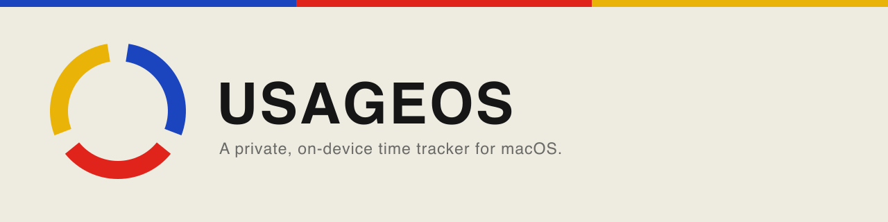
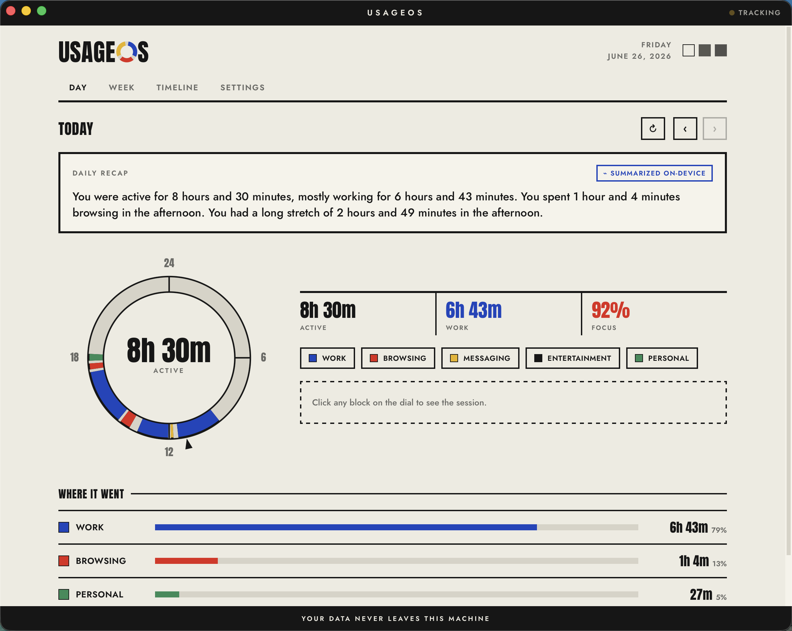
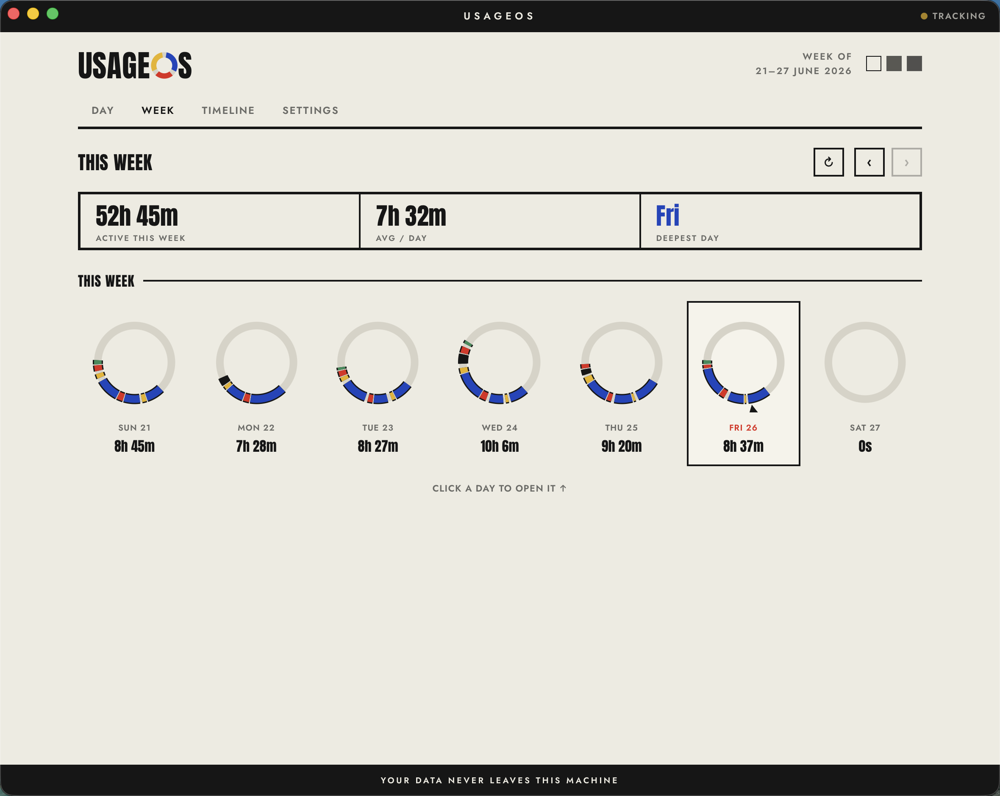
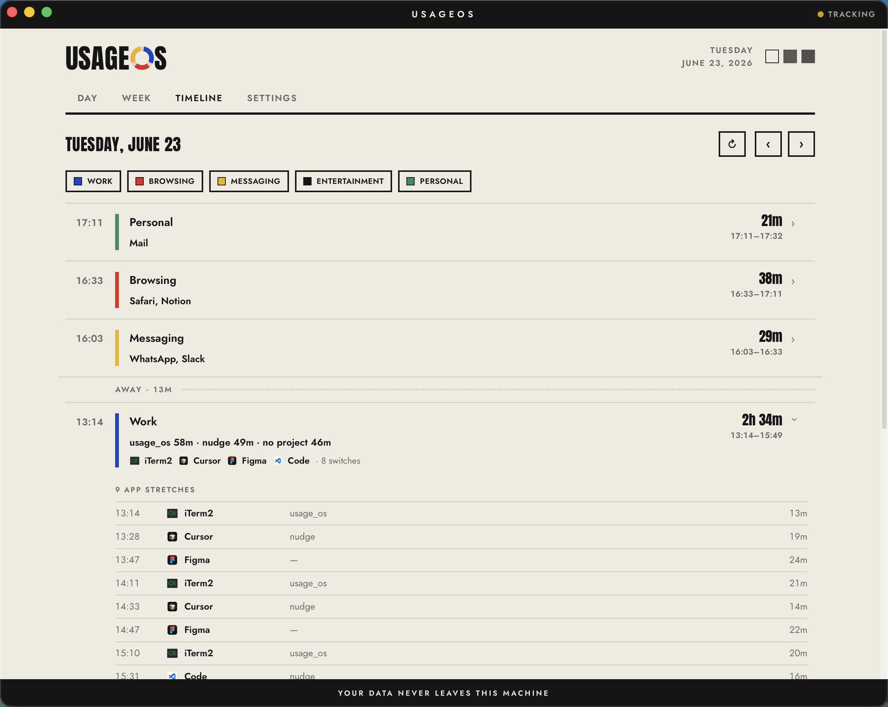

<p align="center">
  
</p>

<p align="center">
  <a href="https://github.com/f-gozie/usage-os/actions/workflows/ci.yml"></a>
  
  
</p>

UsageOS is a time tracker for macOS. It runs quietly in the background, keeps track of which app and window you're using, and shows you where your time actually went — by the hour, and by the kind of work it was. Everything stays on your Mac.

## What it shows

- **A day dial.** Your whole day on a 24-hour clock, with each stretch coloured by the kind of work it was.
- **A daily recap.** A few plain sentences about your day, written on your Mac.
- **A week and a timeline.** Seven days side by side, and a scrollable list when you want the detail.
- **Two ways to read it.** By category — work, browsing, messaging, breaks, personal — and by project, picked up from your window titles.

<p align="center">
  
</p>
<p align="center">
  
  
</p>

## Privacy

- **Nothing leaves your Mac.** No cloud, no account, no telemetry, and no network calls in the data path. It's open source, so you can read the code and check for yourself.
- **Your data is one file** — a local SQLite database on your Mac. Export it or delete it whenever you want.
- **It never uses screen recording.** It reads window titles and, if you allow it, the address of the page open in your browser. That's all it reads.
- **You stay in control.** Private and incognito windows are never recorded. You can leave any app out completely, or mark it private so it still counts the time but hides the title. Password managers and banking apps are left out by default.

## Permissions

UsageOS asks for two macOS permissions. Both are optional — it still works without them, just with less detail.

- **Accessibility** — to read the title of your active window, so it can tell what you were working on, not just which app was open.
- **Automation** — to read the address of the current browser tab, so browsing shows the actual site instead of just “browsing.” Private windows are never read.

It never asks for Screen Recording.

## Install

A signed, notarised download is on the way. Until then, you can build it from source — it's a normal Tauri app.

## Build from source

**Requirements**

- macOS
- Rust (stable)
- Node.js 22 or newer
- Xcode Command Line Tools — `xcode-select --install`

**Run it**

```bash
npm install
npm run tauri dev
```

**Build a release**

```bash
./sidecar/build.sh      # builds the recap helper → src-tauri/binaries/usageos-ai
npm run tauri build
```

The daily recap can use Apple's on-device model (Foundation Models, macOS 26). When that isn't available, UsageOS writes a plain recap instead — nothing else changes.

## Develop

```bash
cargo test --manifest-path src-tauri/Cargo.toml   # Rust tests
npm test                                           # TypeScript tests
```

Before a pull request, these checks must pass: `cargo clippy -D warnings`, `cargo fmt --check`, `cargo test`, `tsc`, and the generated IPC bindings must be up to date.

## How it works

A Rust backend watches macOS for window and app changes through the native Accessibility and Automation APIs, works out the category and project, and stores everything in SQLite. A React and TypeScript frontend draws the dial and the rest of the interface. The recap is written by a small Swift helper using Apple's on-device model, with a plain-text fallback when it isn't available. The interface between Rust and the frontend is generated from the Rust side, so the two can't drift apart.

More detail is in [`context/architecture.md`](context/architecture.md).

## Project docs

- **What it is and why** → [`context/vision.md`](context/vision.md)
- **Decisions** → [`context/decisions.md`](context/decisions.md)
- **Architecture** → [`context/architecture.md`](context/architecture.md)
- **Design system** → [`context/design-system.md`](context/design-system.md)
- **Plans** → [`context/plans/`](context/plans/)
- **Contributor &amp; agent guide** → [`CLAUDE.md`](CLAUDE.md)

## Contributing

Contributions are welcome — see [CONTRIBUTING.md](.github/CONTRIBUTING.md).

## License

MIT — see [LICENSE](LICENSE).
